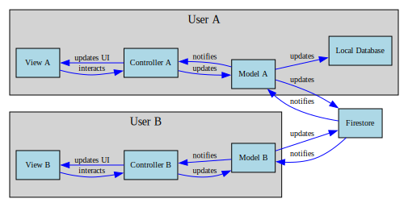
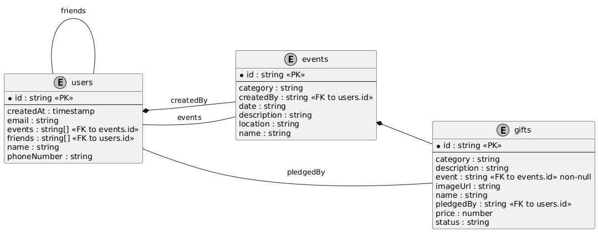
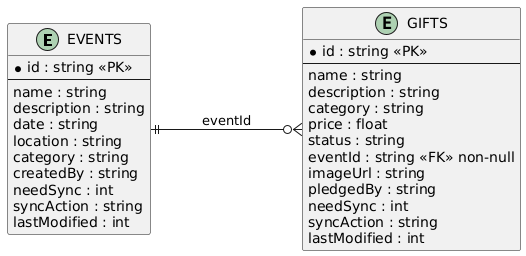

# celebratio

A Flutter application for celebrating special occasions with friends and family.
where you can create events. and add list of gifts you expect to receive. and people can pledge to buy gifts for you.

## App Architecture

This diagram depicts a real-time Flutter app using the MVC pattern with Firestore and a local 
database. Each user View sends actions to the Controller, which updates the Model. The Model
syncs data with Firestore and, for User A, the local database. Firestore notifies all Models 
of changes, prompting Controllers to update Views, ensuring real-time UI synchronization 
across users.

## Firestore Structure
This section outlines the structure of the Firestore database used in the application.

## Local Database Structure

you can notice that there are fields in local database that are not in firestore.
those are used for synchronization purposes.

## Demo

<iframe width="560" height="315" src="https://www.youtube.com/embed/3bToEHU0_jI?si=8Ueafb60xLXoeNfk" title="YouTube video player" frameborder="0" allow="accelerometer; autoplay; clipboard-write; encrypted-media; gyroscope; picture-in-picture; web-share" referrerpolicy="strict-origin-when-cross-origin" allowfullscreen></iframe>

